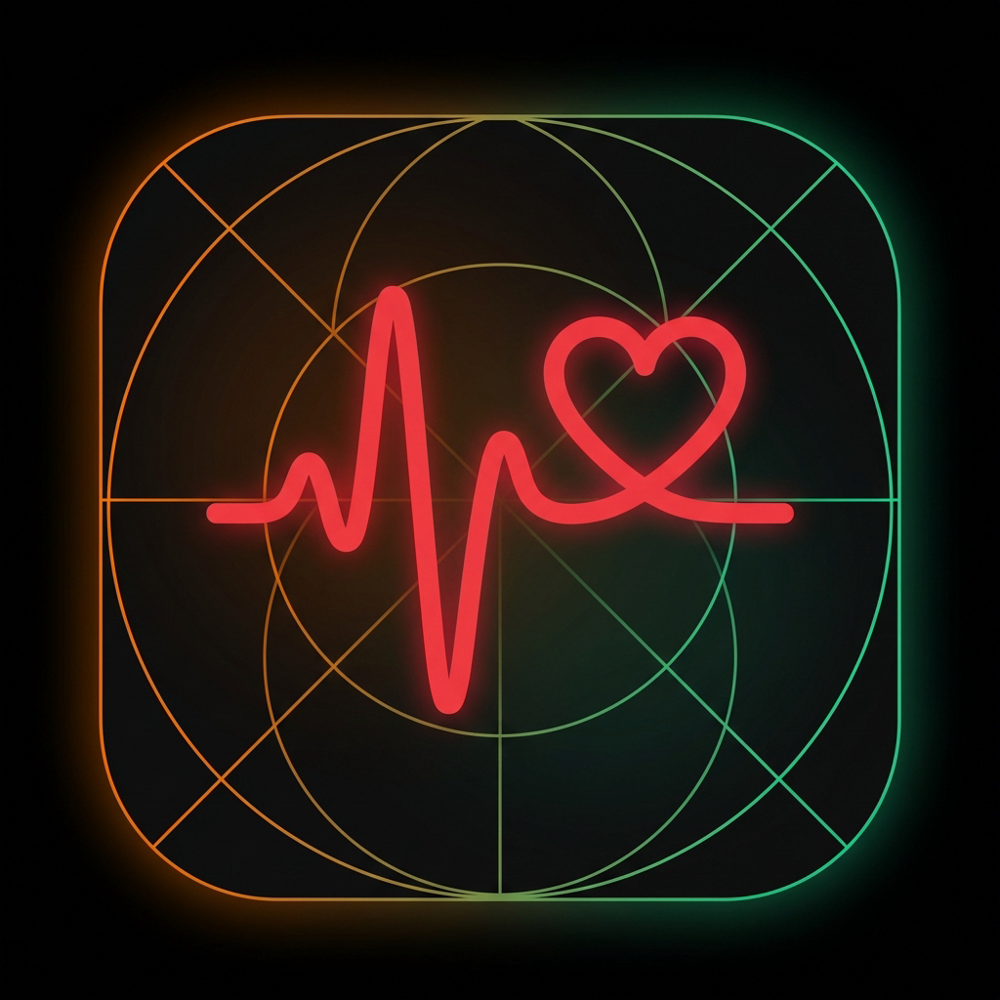

# IoT-Based Smartwatch & Wellness Companion App



An offline-first, IoT-based smartwatch system engineered with an ESP32 microcontroller and a React Native companion app. This project demonstrates real-time physiological monitoring, edge analytics, and an autonomous emergency SOS system operating entirely without cloud dependencies.

**By:** Sannan Adil (BS CS 2022-2026)  
**Institution:** Quaid-i-Azam University, Islamabad

---

## 🌟 Key Features

### 1. Zero-Loss Dual-Core Firmware (ESP32)
Overcame standard IoT "Resource Starvation" loops by implementing **FreeRTOS Task Pinning**.
- **Core 0** is pinned exclusively to high-frequency polling of the MAX30100 PPG sensor to prevent Watchdog Timer (WDT) resets.
- **Core 1** manages Bluetooth Low Energy (BLE) payload serialization, OLED rendering, and secondary sensors.

### 2. Mobile Edge Computing
Sensors capture raw data; the smartphone brains it. The React Native application receives raw JSON payloads over BLE and locally computes complex metrics, ensuring 100% offline data privacy.

### 3. Autonomous SOS Dialer
A gesture-based sequence over the watch UI triggers an emergency procedure. Remaining on the OLED SOS page for 5 seconds forces the watch to broadcast a critical `notify: 1` BLE flag. The smartphone intercepts this, retrieves a locally stored emergency contact, and executes a native OS network call via Android intents.

---

## 📊 Comprehensive Health Dashboard

### Hardware Measured (ESP32)
*   ❤️ **Heart Rate (BPM):** MAX30100 (I²C)
*   🩸 **Blood Oxygen (SpO₂):** MAX30100 (I²C)
*   🌡️ **Body/Ambient Temp:** DS18B20 (OneWire)
*   👣 **Step Count:** MPU6050 (I²C) - Counted dynamically on the ESP32 using a Cartesian vector threshold.

### App Computed (React Native Edge)
*   🔥 **Calories Burned:** Base metabolic scale derived from steps, multiplied by Heart Rate intensity factors.
*   🧠 **Stress Level:** Contextual logic correlating Heart Rate variability against physical movement (Vibration).
*   🔋 **Fatigue Index:** Categorization thresholds based on cumulative physical volume.
*   💧 **Hydration Target:** Manual tracking UI with local storage execution.

---

## 🛠️ Technology Stack

### Embedded Hardware
*   **MCU:** ESP32 (Tensilica LX6 Dual-Core)
*   **Display:** 1.3" SH1106 OLED
*   **Sensors:** MAX30100, MPU6050, DS18B20
*   **Frameworks:** C/C++, Arduino Core, FreeRTOS

### Mobile Application
*   **Framework:** React Native / Expo (Typescript)
*   **State & DB:** React Context API, AsyncStorage
*   **UI/Data Viz:** React Navigation, react-native-gifted-charts
*   **Bluetooth:** `react-native-ble-plx`

---

## 🚀 Installation & Build Guide

### Part 1: Hardware Compilation
1.  Connect your ESP32 board to your PC.
2.  Open `ESP32_Code/ESP32_Code.ino` in the Arduino IDE.
3.  Install the required libraries via the Library Manager: `MAX30100lib`, `Adafruit_MPU6050`, `Adafruit_SH110X`, `DallasTemperature`, `OneWire`, `ArduinoJson`.
4.  Ensure your Board partition scheme has enough space (Default 4MB is sufficient).
5.  Compile and upload. The watch will begin advertising as `SHWatch`.

### Part 2: Mobile App
1.  Install Node.js and the Expo CLI.
2.  Clone this repository and navigate to the root directory.
3.  Install dependencies:
    ```bash
    npm install
    ```
4.  Run the application using Expo Go or build a local APK:
    ```bash
    npx expo start
    ```
5.  **Note on Permissions:** Android requires **Location Services** to be physically turned ON to scan for BLE devices, alongside granted Bluetooth permissions.

---

## 🗂️ Project Structure

```
├── ESP32_Code/           # C++ Firmware handling FreeRTOS & BLE Broadcast
├── src/                  # React Native Source Code
│   ├── components/       # Reusable UI widgets and modals
│   ├── context/          # Global State & Bluetooth Engine (BLEContext)
│   ├── screens/          # Main App Pages (Dashboard, History, Pairing, SOS)
│   └── theme.ts          # Centralized Design System
├── assets/               # Application icons and splash screens
└── (Documentation)       # HTML/CSS source for the Project Poster and Brochure
```

---

## 🔒 Privacy & Architecture
This project is built on the philosophy of **Data Sovereignty**. Unlike commercial smartwatches, this application contains **zero cloud API integrations**. All mathematical health modeling and 7-day historical storage arrays (`@health_history`) exist solely within your encrypted local device storage via `AsyncStorage`.

---

*Academic prototype developed by Sannan Adil as a Final Year Project of Computer Science Degree at Qauid-i-Azam University, Islamabad.*
